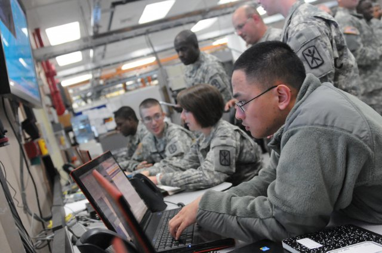

Participated in the installation, operation, and maintenance of satellite communications and internet protocol routing networks that supported over 60% of the U.S. Army’s telecommunications missions.
 
For more information about the Army Regional Hub Node https://peoc3t.army.mil/tn/rhn.php
