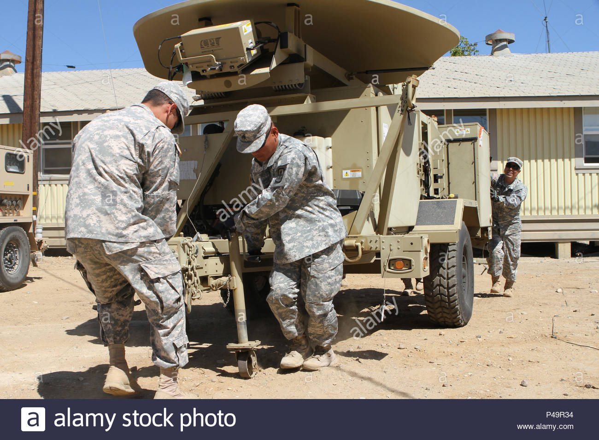
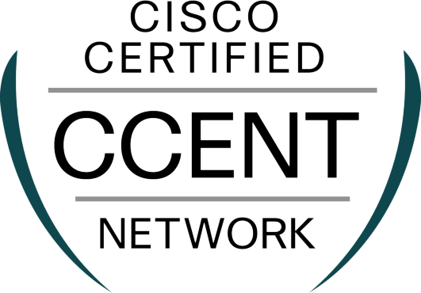

## Introduction

The Army's project to expand its satellite network to support more bandwidth for the warfighter to provide more C4I for today's modern battlefield. The growing need for secure voice and video as well as data on the move helped grow the Regional Hub Node into its primary communication architecture. One of the primary way the army expanded it bandwidth was the introduction of TCP/IP onto the satellite architecture. Previous all communication to the satellite modem was done via serial connection, which was a static bandwidth for each link, causing unused bandwidth to become wasted. With TCP/IP, it allowed the army to used a swtich network, combined with quality of service, allowing bandwidth to be dynamicly allocated for user that were using the link.

## My role in the army

In the US Army, I was assigned to the Regional Hub Nodes located in Fort Bragg, NC and Guam. While Stationed at the Regional Hub Node, I've participated in the installation, operation, and maintenance of satellite communications and internet protocol routing networks that supported over 60% of the U.S. Army’s telecommunications missions. During my time in the army, even though my primary job was maintaining and troubleshooting satellite links, I gained experiance in computer network by working with my peers, learning their job which helpped me become flexible in troubleshooting. When I transfer to Fort Bragg, I not only used my skill in troubleshooting but also train fellow soldier who where new or inexperiance in both satellite and network operations.

## My experiance

This was my biggest learning experience, as I learning to work in a team on massive networks that span over 1000s of IP, working on the latest in satellite communication  gear as well as gaining new skills such as learning how to configure Cisco routers, switches, and VOIP gear to support the modern warfighter. In addition, I also gained my professional cert, earning my Cisco Certified Entry Networking Technician, CompTia Network+ , and CompTia Security+. 

For more information about the Army Regional Hub Node https://peoc3t.army.mil/tn/rhn.php
